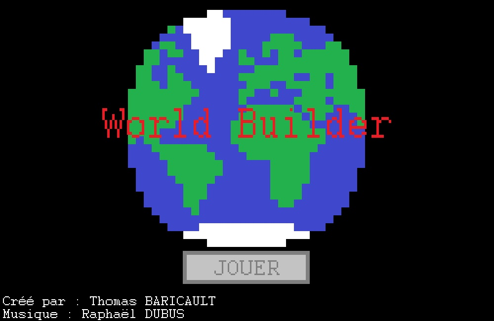
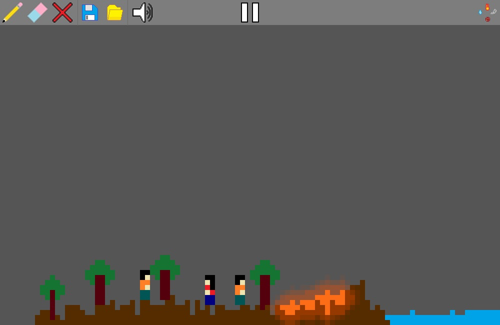

# Python-World-Builder-Game

This is a sandbox game in which you can create a world with multiple elements.
## Features
- Liquids
- Solids
- Gazes
- Electricity systems
- Humans
- Controllable character
## Installation
1. Download the repository by clicking on `Code > Download ZIP`
2. Extract the ZIP file
3. Run `main.pyw`
## Requirements
- Python 3.7
- Python os library
- Python contextlib library
- Python pygame library
- Python random library
## Game Captures
